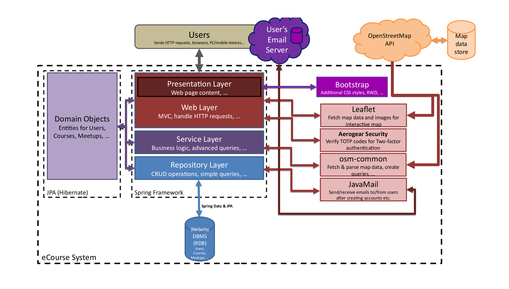

# Architectural Design

## Technologies Used:
In addition to using architecture-oriented technologies such as the Spring framework, Java, HTML, CSS, JavaScript and OpenStreetMap that we are required to use for this project, we are also using the following additional technologies:

* __JavaServer Pages (JSP)__: Used to generate web pages for the front-end implementation of the website. This technology was selected as it integrates well with the Java runtime and the Spring framework. Additionally, all programmers on the team are already familiar with writing JSP code.

* __Gradle__: Used to automate the running of tasks during each build. Gradle was chosen due to the team’s familiarity with using it and mainly due to its ability to automate the downloading and installation of project dependencies.

* __MySQL__: Our database management system (DBMS) of choice; used as a way for us to store data that should be persistent (used for saving and loading user accounts, for example). MySQL was chosen due to its good support with Hibernate and because we are already familiar with using it.

* __Balsamiq Mockups__: We chose it to draft our UI Mockups that were used to show the layout of our website. Balsamiq Mockups was chosen due to its clear interface, resourceful material and it is easy to use for newcomers.

* __Hibernate__: A Java Persistence API (JPA) implementation that we will use to implement data persistence within our application through integration with our DBMS (MySQL). This technology was chosen because it automates the generation of MySQL queries for us, which saves development time and reduces the probability of bugs being introduced into the system due to manually inputting queries.

* __Bootstrap__: A front-end technology that implements numerous different styling options in CSS for our web pages while providing a reactive web design (RWD) solution. Bootstrap was chosen as it simplifies the process of developing web pages that adhere to our design standards defined within our user interface mock-ups. Furthermore, Bootstrap’s support for RWD allows us to adjust our user interfaces to optimize for different screen sizes (such as collapsing the navigation bar on smaller screens to save screen space, for example), which enables us to fulfil the requirement of providing a mobile-friendly version of our website.


## External APIs:
In addition to the technologies stated above, some third-party APIs will also be used within our project:

* __OpenStreetMap API__: An API for querying and retrieving OpenStreetMap map data. We will be using two different libraries to interact with the OpenStreetMap API:
 * __osm-common__: A Java library that fetches raw read-only map data using the OpenStreetMap Overpass API, while providing basic parsing functionality. This library can be used to query the OpenStreetMap API for an address; returning a collection of nodes (buildings and other points of interest), ways and relations (roads and other path connections), for example - this data will be useful when implementing the in-house route finder for course meetups, for example.
 
 * __MapBox & Leaflet__: JavaScript libraries that provide interactive maps using OpenStreetMap map and image data. These libraries were specifically chosen over alternatives due to their advertised focus on mobile-friendliness, which is especially useful because of our requirement to have a mobile version of our website.

* __JavaMail__: An API for sending and receiving email messages using Java. Such an API was needed because of our requirement to send verification and password reset emails to users. JavaMail was chosen due to its official and on-going support from Oracle (the current developers of Java), large user base and its extensive availability of online documentation covering how to effectively use the API within our project.

* __Aerogear Security__: A library that we will be using to implement TOTP, which will be used for verifying authenticator codes used within the two-factor authentication login process. This library was chosen because of how simple it is to use:

```Java
// returns false or throws if invalid
new Totp(secret).verify(code);
```

## Project Source Directory Structure:
We plan for our project to use the following directory structure for its source code:

```
|---src
    |---main
    |   |---java
    |   |   |---ecourse
    |   |       |---controller
    |   |       |---converter
    |   |       |---domain
    |   |       |---dto
    |   |       |---exception
    |   |       |---repository
    |   |       |---security
    |   |       |---service
    |   |       |---validator
    |   |---resources
    |   |---webapp
    |       |---WEB-INF
    |           |---views
    |               |---css
    |               |---error
    |               |---form
    |               |---img
    |               |---js
    |               |---security
    |---test
        |---java
        |   |---ecourse
        |---resources
```


## Architectural Diagram:



## Security Strategy:
The Spring Security framework will be the main tool utilised in ensuring system security, as it provides methods for implementing:

* __User access control__: Using our implementation of user roles, we can differentiate between users that are unregistered or registered users such as:  learners, teachers and administrators, providing appropriate access rights to each. For example, unregistered users will not be able to view course content pages (they will be redirected to the registration page instead, for example), but will be able to view general course overviews and descriptions.

* __Password hashing__: All user passwords will be hashed to protect against risks such as database breaches or other attacks that may expose sensitive user data to a third-party. To achieve this, the bcrypt algorithm will be used to hash and salt passwords, as it has a good reputation for being unbroken and is widely used as a password hashing solution in the software industry.

* __HTTPS__: All network communications between the user’s web client and our web server will be encrypted through the HTTPS protocol; this stops sensitive data such as plain-text passwords being intercepted by a possible third-party while being transmitted to our server through use of the login or registration forms, for example.

* __CSRF protection__: To protect against CSRF, we generate CSRF tokens for each session that are encrypted through HTTPS and are required to be sent with every POST request the user's web client makes. This method will prevent another website from using the user's web client to make a request to our website that modifies an authenticated user's account information, for example.

* __SQL injection prevention__: We will be minimizing our use of manually written SQL queries in favour of JPA and Spring Data's Query Method functionality, in which Spring generates SQL queries for us based on the names of the functions we declare within our repository layer; this functionality is already secured from SQL injection attacks. In any case where we are required to use manually-written SQL queries that work upon user input, we will have to rely on prepared statement functionality, in which our DBMS sanitizes our query appropriately to disallow a user's input to be interpreted as an SQL query in itself.

* __Server-side form validation__: All requests made to our server will be validated to make sure that the input is sensible and does not cause issues with our business logic. Server-side validation will still be used in places where client-side validation is present, as client-side validation can easily be disabled by a user through the use of a web browser's developer tools, for example.

* __File uploads__: Users such as teachers will have the ability to upload content such as images to courses. For reasons such as this, we will need to check that uploaded files are below a certain file size appropriate for that type of file and that the file is of the correct format (only images can be used for course overview pictures, for example).

Additionally, high-level security features specific to users will also be implemented, such as the requirement to verify email addresses when registering and the ability to request a password reset for an account. Respectively, these features will protect against users registering with email addresses that they do not own and provide the ability to recover accounts where the password has been forgotten or changed unwillingly by some third-party.


## Special Design Choices:

Some special measures were put in place in regards to system design to ensure system maintainability and reduce the chance of risks occurring during development.

Enumerated types (```enum```s) are used to represent variables that can take a set of named values inside of our system, with user roles and course difficulty levels being an example of this. Compared to alternatives such as using constant integers (```final int```) to represent the different named types, enumerated types come with the advantage of having distinct types in Java, such that it is disallowed to assign a variable expecting a user role to a course difficulty level when using an enumerated type compared to a constant integer, which reduces the risk of unintentional assignments being made, for example.

```Java
// Constant Integers
final int USER_ADMIN = 0;
final int COURSE_INTERMEDIATE = 1;
// ...
int courseType = USER_ADMIN; // OK when using ints instead of enums - high potential for mistakes

// Enumerated Types
private enum UserType {
  ADMIN, LEARNER, TEACHER
}
private enum CourseLevel {
  BEGINNER, INTERMEDIATE, ADVANCED
}
UserType userType = CourseLevel.ADVANCED; // compile error; types differ - good use of the type system to mitigate such mistakes
```

In addition to enumerated types, JPA type converters were utilised within the system to encode and decode our enumerated types in a manually-defined format that could be persisted within our database, regardless of the names and order of the constants defined within the enumerated types, which reduces the risk of name or order changes causing previously persisted data to be interpreted differently.

Interfaces will be utilised within the project, especially for repositories and services, with an accompanying concrete class implementing it if necessary. The reason for this design decision is to give us some flexibility so that we are able to swap out the implementation of an interface available to us if it is required for testing or other purposes, for example.

### Performance considerations: ###

Special measures will need to be directed towards system performance in order to support our target of 100 concurrent users interacting with our system. Additionally, we will need consider the responsiveness of the content we serve to user web clients in order to make sure that the website performs well on various desktop and mobile platforms.

If possible, we will execute a selection query through our persistence layer when looking for a particular entity (such as a row within our courses table) instead of loading a collection containing many entries of that entity and manually iterating through them on the server-side; this will allow us to find entities faster (potentially O(log n) or better if searching via a primary key), which will improve server response times and minimize processor usage.

Fetch types for relationship attributes within domain classes are set to be lazy (```fetch=FetchType.LAZY```) unless necessary to have them otherwise. Lazy fetches only query our persistence layer for the entity at the other side of the relation if our runtime tries to access the attribute, which is generally a good strategy from an application performance perspective, as it is unlikely that we will be frequently accessing these attributes in most cases.

Pagination will be used if necessary to avoid rendering large amounts of content on a user's web client. Certain actions such as an administrator searching for a particular user may return a huge amount of results that can degrade web client performance (especially on mobile) if results are not split into different pages.

Some forms with man, as client-side validation could easily be bypassed through the use of web browser development tools, for example.y fields (such as the registration form) will have client-side validation in order to minimize the amount of rejected requests made to our servers. It is important to note that server-side validation will still be present for these forms as a security precaution.

